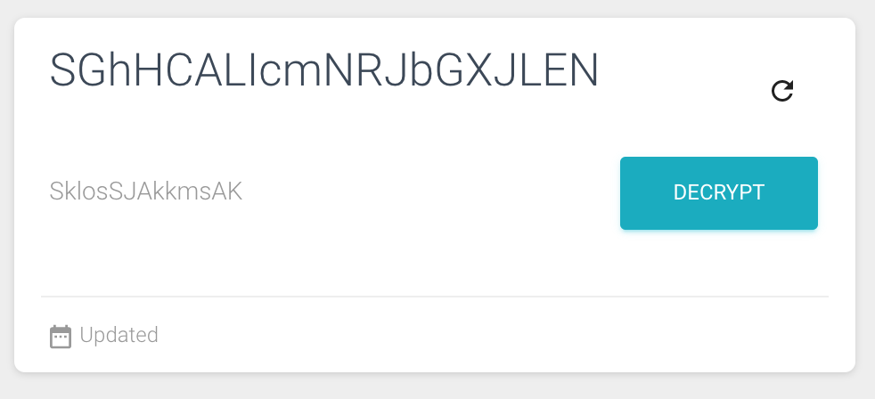

# Early2019-Interview-Task-Wipadika-innovations

>We love people who like learning new things and thinking in the abstract. This task (hopefully) helps you discover and few new services and help illustrate some of your front end skills to us.

_Here's what you need to do:_

1) Clone this repository. **(DO NOT PUBLICLY FORK IT and DO NOT POST SOLUTIONS ONLINE)**

2) Choose one to perform the task

    a. ReactJs

    b. AngularJs

    c. React Native

3) Task: Make The Component as shown bellow

    1. The Main Text should get it from the bellow API
        URL: https://cdjmy3ceu7.execute-api.ap-south-1.amazonaws.com/dev/message

        Method: get

        Auth Headers => x-api-key : 1Vt72wYzBu2VGbdTVuC96YGB8mEMOkY6B2OqsSyb

        Response => 
        
                {
                    "statusCode": 200,
                    "status": "success",
                    "data": {
                        "message": "rpZpxwZGzezFuJrLCgrL"
                    }
                }

    2. The Main Text Should Refresh on clicking Refresh button, and everytime window reloads

    3. create REST API using firebase cloud functions:

        Method: post
        Req : {

            type : 'encrypt', // or 'decrypt'

            plain_text : 'Hello World', // plain text if encrypt

            secret : 'ABCD001',

            cipher_text : '' // if type is decrypt provide ciphertext

        }

        // IF type is encrypt show encrypted text

        Res : {

            statusCode: '200',
        
            status: 'success',

            cipherText: '12n3hbubhbah2mlkaAmKkkcksksznk'

        }

        // IF type is decrypt show decrypted text

            Res : {
                        statusCode: '200',
                        status: 'success',
                        plainText: 'Hello world'
                    }

    4. firebase function Logic : 

        a) on click button Encrypt call the Rest API with type = 'encrypt' it should give the encrypted value

        b) on click button Decrypt call the Rest API with type = 'decrypt' it should give the original text what you sent as plain text
        

        d) All the values you should get from the API

    5. on Pressing Refresh Button while getting the result show loader untill the value comes as shown bellow.

6) Once Done provide firebase commands to build, run and deploy.

7) ZIP the folder and send it to dev@wipadika.com

*All the Best*